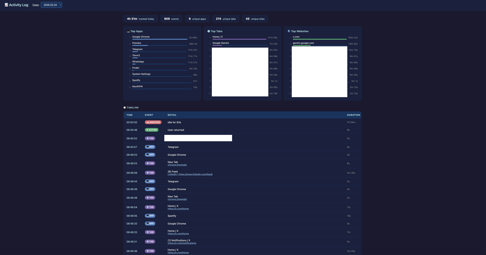

# Reflect

> "You can't manage what you don't measure." — Peter Drucker

A lightweight macOS activity tracker.

 Logs which app (and Chrome tab) you're using throughout the day, and provides a local web UI to review your time.

## Files

| File | Purpose |
|---|---|
| `activity_monitor.py` | Background process that polls and logs activity |
| `activity_viewer.py` | Web UI for browsing the log |
| `activity_log.csv` | Append-only event log (created automatically) |

## Usage

### 1. Start the monitor

```bash
python activity_monitor.py
```

Runs in the foreground. Press `Ctrl+C` to stop. Events are printed to stdout and appended to `activity_log.csv`.

> **macOS permissions:** System Events access is required to detect the frontmost app. Grant it under **System Settings → Privacy & Security → Automation**.

### 2. Open the viewer

```bash
python activity_viewer.py
```

Then open http://127.0.0.1:5000 in your browser.

Options:

```
--port 8080          Use a different port (default: 5000)
--csv /path/to.csv   Use a different log file
```

## Event types

| Event | Meaning |
|---|---|
| `START` | Monitor started |
| `APP` | Frontmost application changed |
| `TAB` | Active Chrome tab changed |
| `INACTIVE` | User idle beyond threshold |
| `ACTIVE` | User returned from idle |

## Configuration

Edit the constants at the top of `activity_monitor.py`:

| Constant | Default | Description |
|---|---|---|
| `IDLE_THRESHOLD` | `60` | Seconds of no input before marking as inactive |
| `POLL_INTERVAL` | `5` | Seconds between checks |
| `CSV_PATH` | `activity_log.csv` | Log file location |

## Requirements

- macOS (uses `ioreg` and `osascript`)
- Python 3.10+
- No third-party dependencies
